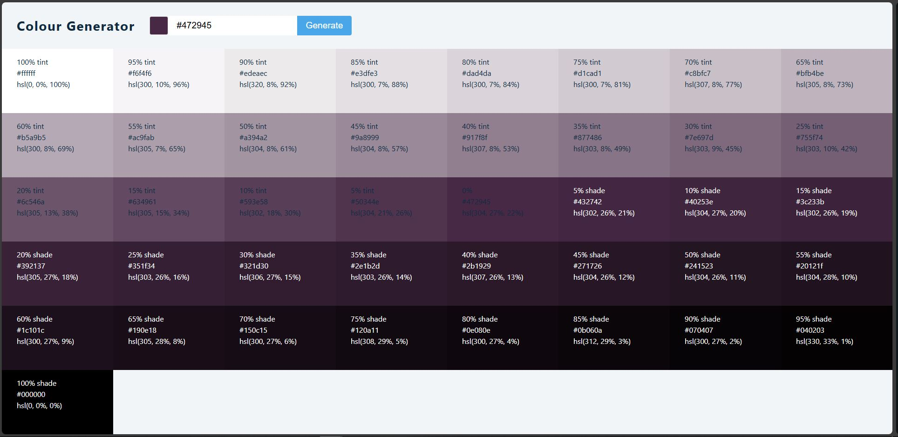
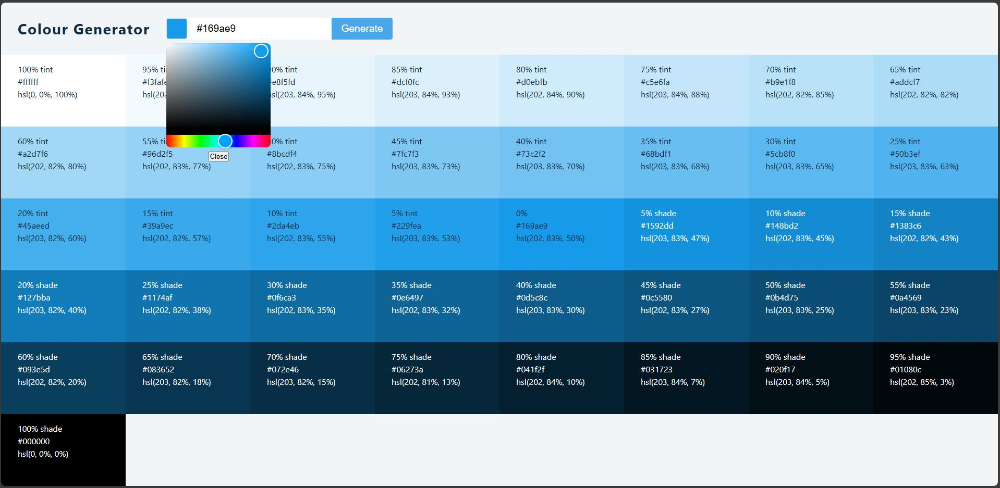

# Colour Generator app.

---

### Description

This project is a React-based colour shade generator, developed as part of a learning exercise to strengthen my React skills. Inspired by a [YouTube tutorial](https://www.youtube.com/watch?v=a_7Z7C_JCyo) by _freeCodeCamp\.org_, the application allows users to select or enter a colour and view dynamically generated shades and tints of that colour. The project helped me gain hands-on experience with React concepts such as state management, component structure, and user interaction. It also demonstrates practical functionality that could be useful for designers or developers working with colour palettes.

### Screenshots

  
  &nbsp; &nbsp; &nbsp; &nbsp;
  

(_full size images can be found [here](./screenshots)_)

### Functionality

- Enter a hex colour code to generate shades of that colour.
- Use colour picker to select a colour as an alternative method.
- See the colour's hsl and hex values.
- Copy the colour's hex value to the clipboard on selection.

### Modifications

The modifications done to this app. were user experience upgrades and opportunities to explore more of the packages available for JavaScript. The changes were:

- Addition of selected colour indicator.
- Addition of the colour picker.
- Use of react-toastify for notifications/reactivity.
- Addition of the colour's hsl value.
- Greater number of shades/tints.

### Requirements

- A web browser
- Node.js
- git

### How to use

To use the application, you can either go [here](https://luke663.github.io/react-colour-generator/) to see the app. hosted via GitHub pages or host it locally by completing the following steps:

- Clone the application.

  - Open a command terminal.
  - Navigate to the directory on your computer where you wish to put the repository.
  - Run the commands:
    - git clone https\://github\.com/Luke663/react-colour-generator
    - cd react-colour-generator
    - npm install

- Run the application.

  - Run the command:
    - npm run dev
  - Click (or copy and paste into a browser) the local address that appears in the terminal.

### License

This is a demonstration project and not intended for collaboration, as such a license has not been added meaning the default copyright laws apply and no one may reproduce, distribute, or create derivative works from this work.
